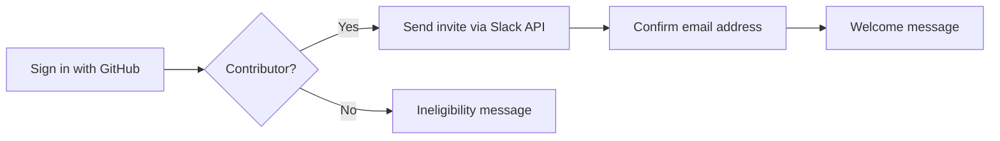
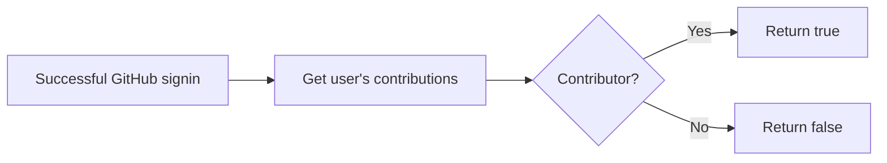

## Building Elixir School's Admissions application

If you didn't know, Elixir School has it's own Slack where contributors can gather to discuss our organization's content and projects but most importantly, support one another in our Elixir journey. When we set out to create our own Slack we wanted to address a big concern with many public Slacks: the signal to noise ratio is bad, there's just too much spam. 

> Have you contributed to an Elixir School project but not joined us on Slack? Head over to https://admissions.elixirschool.com to get your invite today!

So how can we keep our Slack public but prevent spammers from joining and do so in a way that doesn't add work to our maintainers? Our solution: required at least once contribution of any side to any one of our projects. 

Achieving this required an application that used GitHub to verify a user's eligibility. This application would come to be known as: Admissions.

> Want to skip ahead and see the final product? The code can be found at https://github.com/elixirschool/admissions.

In this post we're going to explore how Admissions works and how we achieved our goals using Elixir and Phoenix. To start let's look at the expected flow and work from there:



In addition to telling us how the application should function, this diagram breaks the flow up into convient development task. Working from this diagram let's explore the individual tasks we'll need in order to fulfill our high level requirements:

1. Allow a user to sign in using GitHub and capture their access token. We can leverage [Ueberauth](https://github.com/ueberauth/ueberauth) and its [GitHub strategy](https://github.com/ueberauth/ueberauth_github) to do the heavy lifting for us.
2. With the user's access token use the GitHub API to see if the user has contributed to an organization's project. To avoid having to spend time writing our own GitHub API client we're going to make use of [Tentacat](https://github.com/edgurgel/tentacat).
3. Using the result of the API search, process the user's result
   1. In the event a user **is** a contributor, have them confirm the email address they want to use for Slack, use the Slack API to send an invite, and finally congratulate them.
   2. If they **have not** contributed we need to notify them of their inelibility

> Note: For our application we've renamed `PageController` to `EligibilityController` to fit with our school admissions theme.

### Login with GitHub

Starting from a new Phoenix project (`mix phx.new admisssions`)  we looked at how to support GitHub login. For that we need a new dependency: `ueberauth_github`:

```elixir
  defp deps do
    [
      {:gettext, "~> 0.11"},
      {:phoenix, "~> 1.4.0"},
      {:phoenix_html, "~> 2.11"},
      {:plug_cowboy, "~> 2.0"},
      {:ueberauth_github, "~> 0.7.0"},

      {:phoenix_live_reload, "~> 1.2", only: :dev}
    ]
  end
```

> We won't need to include `ueberauth` itself, as a dependency  of `ueberauth_github` it is included for us.

> Helpful tip: Did you know you can use `mix hex.info <package name>` to get the latest version? Try it!

With our application empowered with our new dependency what's left to do? Plenty! To finish our integration with Ueberauth we had a few subtasks:

1. Create a `AuthController` that'll handle the callback phase of the OAuth request.

2. Include our new controller and route in our `router.ex` file.

3. Put the required the configuration for Ueberauth in our `config/config.exs` file.

4. Add a button to the UI for login. While we won't spend time in this article building the UI, we will touch on the required pieces.

5. Setting up your application on GitHub. Here you'll also need to retrieve your `CLIENT_ID` and `CLIENT_SECRET` .

   > GitHub setup and configuration goes beyond this article. If you aren't quite sure what to do, head over to GitHub's Developer article [Authorizing OAuth Apps](https://developer.github.com/apps/building-oauth-apps/authorizing-oauth-apps/) 

Onward!

#### Our new controller

Completing our first subtask requires we create a new controller for Ueberauth that will handle the OAuth callback from GitHub in the event of successful login. The only hard requirement for our controller is that we include the Ueberauth plug:

```elixir
defmodule AdmissionsWeb.AuthController do
	use AdmissionsWeb, :controller

  plug Ueberauth
end
```

With the plug now in place we defined our the function to handle our requests which we've elected to name `callback/2`. This function  needs to retreive the user details Ueberauth has so convienently placed into the `Plug.Conn` assigns for us. The fields we're concerned with are the user's email, GitHub nickname, and access token:

```elixir
defmodule AdmissionsWeb.AuthController do
	use AdmissionsWeb, :controller

  plug Ueberauth

  def callback(%{assigns: %{ueberauth_auth: ueberauth_auth}} = conn, _params) do
    %{credentials: %{token: token}, info: %{email: email, nickname: nickname}} = ueberauth_auth
  end
end
```

There's no need to concern ourselves _in this instance_ with a match error because all successful logins will contain the aforementioned fields.

Now that we've got what we need, we need to forward the user on to the next step in the process: determining eligibility. To ensure we've got what we need in the next step, we chose to put our GitHub data into the session and then redirect the user to the eligibility check:

```elixir
defmodule AdmissionsWeb.AuthController do
	use AdmissionsWeb, :controller

  plug Ueberauth

  def callback(%{assigns: %{ueberauth_auth: ueberauth_auth}} = conn, _params) do
    %{credentials: %{token: token}, info: %{email: email, nickname: nickname}} = ueberauth_auth
    
    conn
    |> put_session(:github, %{email: email, nickname: nickname, token: token})
    |> redirect(to: Routes.registrar_path(conn, :eligibility))
  end
end
```

With that in place we're done with our controller and can move on to the next subtask, updating our `router.ex`. We'll be implementing our `eligibility` request handler shortly.

#### Updating Phoenix's router

Updating the router for Ueberauth is a fairly easy and straight forward change. At the bottom of our `router.ex` we added the following scope block:

```elixir
scope "/auth", AdmissionsWeb do
  pipe_through :browser

  get "/github", AuthController, :request
  get "/github/callback", AuthController, :callback
end
```

We added 2 routes but only 1 request handler, `callback/2` in our controller so what gives? Remember  `plug Ueberauth` from our controller? Our good friend Ueberauth takes care of that request phase of the OAuth exchange saving us the hassle.

At this stage we're almost done with our integration. Now we can move on to configuration Ueberauth for our application.

#### Ueberauth configuration

The Ueberauth GitHub strategy's documentation provided us everything we needed. Since we need the user's email and profile access we had to update our scopes to `user:email,user:profile` per GitHub's documentation.

The resulting changes to our `config.exs` looked like this:

```elixir
config :ueberauth, Ueberauth,
  providers: [
    github: {Ueberauth.Strategy.Github, [default_scope: "user:email,user:profile", send_redirect_uri: false]}
  ]

config :ueberauth, Ueberauth.Strategy.Github.OAuth,
  client_id: System.get_env("GITHUB_CLIENT_ID"),
  client_secret: System.get_env("GITHUB_CLIENT_SECRET")
```

With `System.get_env/1` we avoid checking secret values into source control in addition to supporting changes to those values at runtime. We populate the `GITHUB_CLIENT_ID` and `GITHUB_CLIENT_SECRET` system ENVs in a later step using values retrieved from our GitHub application settings.

> Confused about compile and runtime configuration? Check out our blog post [Configuration Demystified](https://elixirschool.com/blog/configuration-demystified/) to learn more.

An optional but strongly encourage configuration is to update the `oauth2` serializer to use the newer JSON library [Jason]():

```elixir
config :oauth2,
	serializers: %{
		"application/json" => Jason
	}
```

To do this we added `jason` to our  `mix.exs` just as we did before with `ueberauth_github`.

#### Sign-in button

To kick off the auth flow for GitHub logins we need the user to click a link for the earlier request route we defined. To do that we added the following HTML to our `index.html.eex` file:

```html
<a class="button is-info is-medium" href="/auth/github">
  <span class="icon">
    <i class="fab fa-github"></i>
  </span>
  <span>Sign-in with GitHub</span>
</a>
```

Now that our UI is updated we can call our Ueberauth integration code complete! The last step for us was setting up the application on GitHub. Once complete we pulled the `CLIENT_ID` and `CLIENT_SECRET` from the application settings and added them to our ENV.

A user can now sign-in with a valid GitHub account. We need to handle the next step in the process: eligibility.

### Verifying contributor status





### Processing the user's request